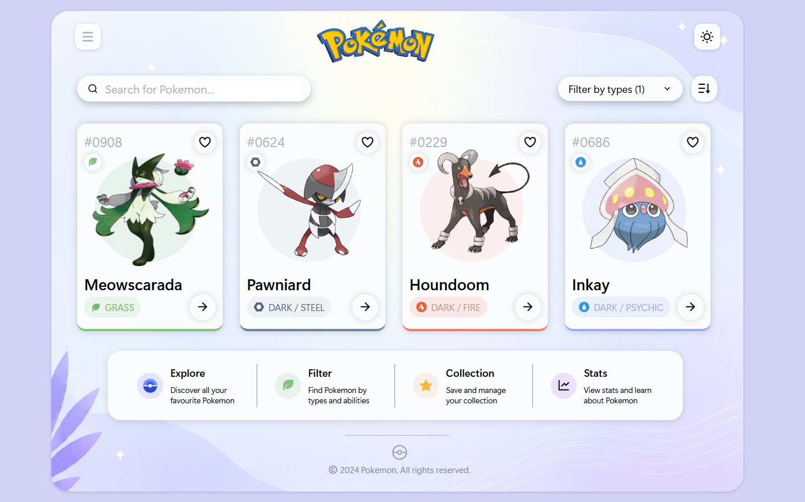

# ⚡ Pokémon UI — Position Properties Practice

## 📌 Project Overview

**Live Demo:** [View Live Project](YOUR_LIVE_DEMO_LINK_HERE)



---

A **frontend UI practice project** built from scratch using **HTML5 and CSS3**, created specifically to strengthen my understanding of **CSS positioning properties and UI layout composition**.

The interface is designed as a Pokémon discovery/catalog dashboard containing a navigation area, search and filtering controls, Pokémon cards, feature sections, and a footer.

The primary focus of this project was understanding how **`position: relative` and `position: absolute` work together**, especially when positioning images, decorative elements, controls, and sections inside parent containers.

Rather than relying on a CSS framework, the UI was created using **core HTML and CSS layout techniques**.

---

## 🎯 Project Objective

The main objective was to practice how UI elements can be:

* Positioned precisely inside containers
* Layered over other elements
* Aligned using Flexbox
* Controlled using `top`, `left`, `right`, and `bottom`
* Positioned relative to their parent elements
* Combined with fixed dimensions and spacing
* Visually composed into a complete interface

### Primary CSS Focus

`position: relative` · `position: absolute` · `top` · `left` · `right` · `Flexbox` · `gap` · `overflow` · `border-radius` · `box-shadow`

---

## 🖥️ UI Sections

The project contains multiple UI sections:

### 1. Navigation

The top navigation includes:

* Pokémon logo
* Menu icon
* Theme/sun icon

The navigation elements are styled using Flexbox and positioned relative to the main container.

---

### 2. Search & Filter Section

The interface includes:

* Pokémon search field
* Type filtering control
* Sorting control
* Search icon
* Dropdown arrow

The entire section is positioned using:

```css
.type {
    position: absolute;
    top: 75px;
    left: 30px;
    right: 30px;
}
```

This provided practical experience with absolute positioning inside the main layout.

---

### 3. Pokémon Card Grid

The main content contains **4 Pokémon cards**:

| Pokémon     | Type           |
| ----------- | -------------- |
| Meowscarada | Grass          |
| Pawniard    | Dark / Steel   |
| Houndoom    | Dark / Fire    |
| Inkay       | Dark / Psychic |

Each card contains:

* Pokémon number
* Favourite/heart button
* Pokémon image
* Pokémon name
* Type indicator
* Ability/type icon
* Navigation arrow

The cards use a combination of **Flexbox, relative positioning, and absolute positioning**.

---

### 4. Feature Section

The lower section contains **4 feature cards**:

| Feature    | Description                         |
| ---------- | ----------------------------------- |
| Explore    | Discover all your favourite Pokemon |
| Filter     | Find Pokemon by types and abilities |
| Collection | Save and manage your collection     |
| Stats      | View stats and learn about Pokemon  |

These sections demonstrate practical usage of:

```css
display: flex;
align-items: center;
justify-content: center;
gap: 20px;
```

---

## 🛠️ Technologies Used

| Technology               | Purpose                                     |
| ------------------------ | ------------------------------------------- |
| **HTML5**                | Page structure and UI elements              |
| **CSS3**                 | Styling and layout                          |
| **CSS Positioning**      | Precise placement of elements               |
| **Flexbox**              | Alignment and spacing                       |
| **CSS Box Shadow**       | Depth and card elevation                    |
| **CSS Border Radius**    | Rounded UI components                       |
| **CSS Background Image** | Main dashboard background                   |
| **Remix Icon**           | Search, menu, heart, filter and other icons |
| **SVG / PNG Assets**     | Pokémon and UI graphics                     |

---

## 📊 Project Metrics

* **1** HTML document
* **1** CSS stylesheet
* **4** Pokémon cards
* **4** feature cards
* **2** primary search/filter controls
* **1** main dashboard container
* **1** navigation section
* **1** footer section
* **4** Pokémon visual assets
* **Multiple** Remix Icons for interface controls
* **120 × 120px** primary Pokémon image containers
* **30px** navigation icon containers
* **30 × 30px** feature icons
* **20px** primary layout gap
* **15px** main container padding
* **800px** maximum main container width
* **665px** feature-section width

> Metrics above are based on the current HTML/CSS implementation and are intended to document the structure of the practice project.

---

## 🧩 Key CSS Concepts Practiced

### 1. Parent-Child Positioning

One of the main concepts practiced in this project was creating a positioned parent:

```css
.card1 {
    position: relative;
}
```

and then positioning its children independently:

```css
.middle {
    position: absolute;
    top: 40px;
    left: 20px;
}
```

This helped me understand how an absolutely positioned element uses its positioned ancestor as a reference point.

---

### 2. Absolute Positioning

Several UI components use:

```css
position: absolute;
```

Examples include:

* Pokémon images
* Search/filter section
* Feature section
* Footer
* Pokémon type/ability indicator
* Card image containers

This allowed individual UI elements to be placed precisely within their parent containers.

---

### 3. Relative Positioning

The project uses relative positioning as a positioning context:

```css
main {
    position: relative;
}
```

and:

```css
.card1 {
    position: relative;
}
```

This creates a relationship between parent and child elements and makes absolute positioning predictable.

---

### 4. Flexbox Layout

Flexbox was heavily used throughout the interface.

Example:

```css
.card1 {
    display: flex;
    flex-direction: column;
    justify-content: space-between;
}
```

The project also uses:

```css
display: flex;
align-items: center;
justify-content: center;
gap: 20px;
```

to control alignment and spacing.

---

### 5. Nested Positioning

The Pokémon image elements use multiple positioning layers.

For example:

```css
.middle {
    position: absolute;
}

.m1 {
    position: absolute;
}
```

This helped reinforce the concept of **positioning an element inside another positioned element**.

---

### 6. Box Shadows

Multiple interface components use shadows to create depth:

```css
box-shadow:
    0 0 8px rgba(0, 0, 0, 0.18);
```

This was applied to:

* Cards
* Buttons
* Search boxes
* Circular controls
* Navigation elements

---

### 7. Responsive Input Sizing

The search input uses:

```css
input {
    flex: 1;
    min-width: 0;
}
```

This allowed the input to occupy the remaining available space inside the Flexbox search container.

---

### 8. Background Image Composition

The main dashboard uses a background image:

```css
main {
    background-image: url("./asset/bg.png");
    background-size: cover;
    background-position: center;
    background-repeat: no-repeat;
}
```

This helped practice how background images can be integrated into a UI container.

---

## 🎨 UI Components

The interface contains:

* Pokémon logo
* Navigation controls
* Search bar
* Type filter
* Sorting control
* Pokémon card grid
* Pokémon images
* Favourite buttons
* Type badges
* Ability indicators
* Navigation arrows
* Explore feature
* Filter feature
* Collection feature
* Statistics feature
* Decorative footer
* Copyright information

---

## 🧠 Key Learnings

This project helped reinforce my understanding of:

* Difference between `relative` and `absolute` positioning
* Parent-child positioning relationships
* CSS containing blocks
* Positioning elements with `top`, `left`, and `right`
* Flexbox alignment
* `flex: 1`
* `min-width: 0`
* Nested absolute positioning
* Spacing with `gap`
* Card-based UI composition
* Image positioning
* Box shadows
* Border radius
* Background image positioning
* Typography hierarchy
* UI visual consistency
* Combining multiple CSS techniques into one layout

---

## 🔍 Development Approach

The UI was developed in an iterative process:

```text
Visual Reference
      ↓
Analyze Layout
      ↓
Break UI into Sections
      ↓
Create HTML Structure
      ↓
Create Parent Positioning Contexts
      ↓
Implement Absolute Positioning
      ↓
Add Flexbox Layout
      ↓
Position Images & Icons
      ↓
Adjust Spacing & Typography
      ↓
Refine Visual Appearance
```

The goal was not simply to make the interface look similar, but to understand **how the layout was constructed and why each CSS positioning technique was required**.

---

## 📁 Project Structure

```text
Pokemon-UI/
│
├── index.html
├── style.css
│
└── asset/
    ├── bg.png
    ├── pokemon_logo.svg
    ├── meowscarada.png
    ├── pawniard.png
    ├── houndoom.png
    ├── inkay.png
    ├── steel.svg
    ├── fire.svg
    ├── water.svg
    ├── pokru.svg
    └── pokemon_ball.svg
```

---

## 🚀 Future Improvements

Planned improvements for future versions:

* Add responsive support for mobile and tablet devices
* Replace fixed positioning with more scalable layout techniques where appropriate
* Add functional Pokémon search
* Add working type filters
* Add sorting functionality
* Add favourite/collection interactions
* Add hover animations and transitions
* Add JavaScript-based interactions
* Improve accessibility
* Improve semantic HTML structure
* Convert the static interface into a fully functional Pokémon dashboard

---

## 📌 Project Type

**Frontend UI Practice / CSS Positioning Practice**

### Core Skills Demonstrated

`HTML5` · `CSS3` · `CSS Positioning` · `Flexbox` · `Absolute Positioning` · `Relative Positioning` · `UI Composition` · `Card Layout` · `Typography` · `Visual Design`

---

## 👨‍💻 Author

**Utkarsh Kushwaha**

Frontend Development Practice
GitHub: [Utkarsh1260](https://github.com/Utkarsh1260)
